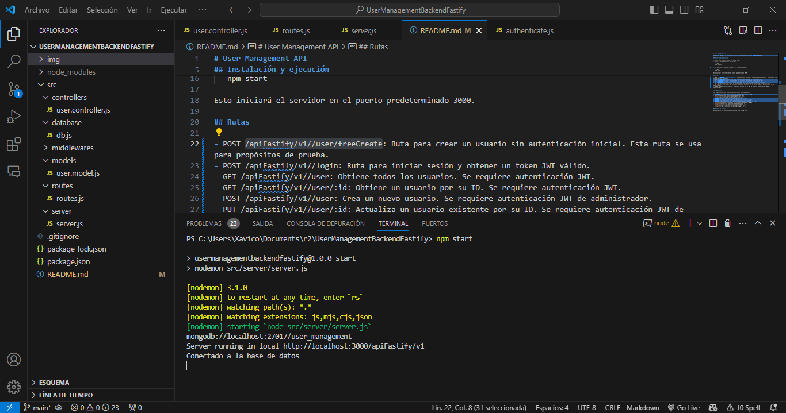
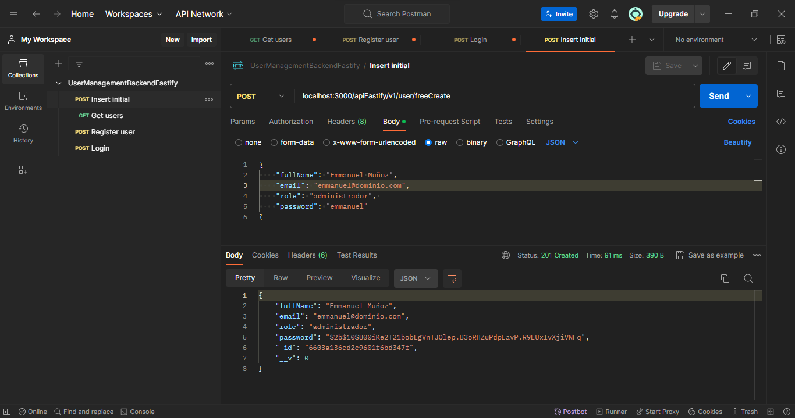
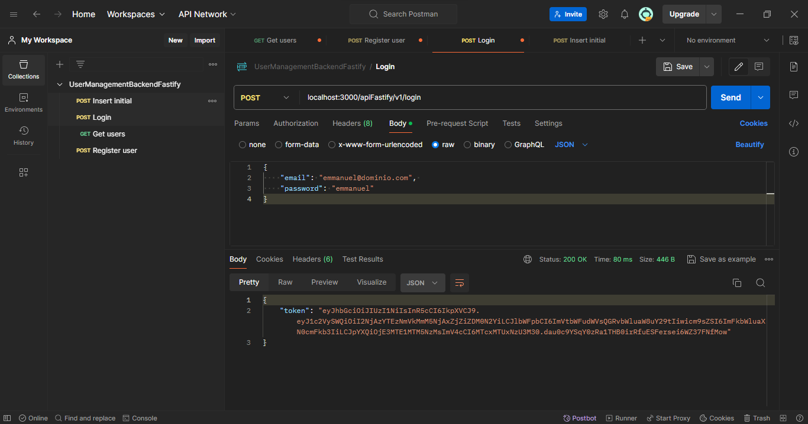
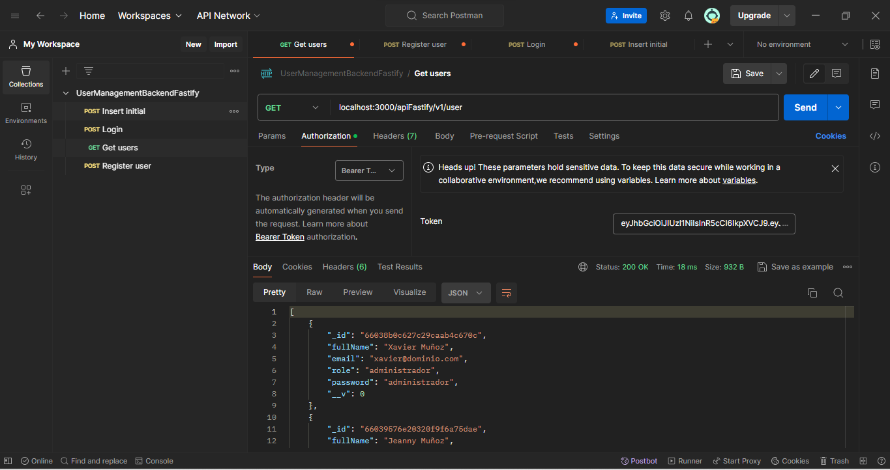

# User Management API

Este es un API para la gestión de usuarios, desarrollado utilizando Fastify y MongoDB.

## Instalación y ejecución

1. Clona este repositorio en tu máquina local.
2. Instala las dependencias usando npm:

   ```bash
   npm install

3. Para iniciar el servidor, ejecuta el siguiente comando:

   ```bash
   npm start

Esto iniciará el servidor en el puerto predeterminado 3000.

## Rutas

- POST /apiFastify/v1//user/freeCreate: Ruta para crear un usuario sin autenticación inicial. Esta ruta se usa para propósitos de prueba.
- POST /apiFastify/v1//login: Ruta para iniciar sesión y obtener un token JWT válido.
- GET /apiFastify/v1//user: Obtiene todos los usuarios. Se requiere autenticación JWT.
- GET /apiFastify/v1//user/:id: Obtiene un usuario por su ID. Se requiere autenticación JWT.
- POST /apiFastify/v1//user: Crea un nuevo usuario. Se requiere autenticación JWT de administrador.
- PUT /apiFastify/v1//user/:id: Actualiza un usuario existente por su ID. Se requiere autenticación JWT de administrador.
- DELETE /apiFastify/v1//user/:id: Elimina un usuario por su ID. Se requiere autenticación JWT de administrador.

## Ejemplo de Uso

Ejecutando el servidor


Primer registro de API libre


Validar credenciales y generar token


Listar usuarios validando token


## Dependencias

Las siguientes son las dependencias utilizadas en este proyecto:

- [@fastify/cors](https://www.npmjs.com/package/@fastify/cors) v9.0.1
- [bcrypt](https://www.npmjs.com/package/bcrypt) v5.1.1
- [boom](https://www.npmjs.com/package/boom) v7.3.0
- [fastify](https://www.npmjs.com/package/fastify) v4.26.2
- [fastify-cors](https://www.npmjs.com/package/fastify-cors) v6.1.0
- [fastify-jwt](https://www.npmjs.com/package/fastify-jwt) v4.2.0
- [fastify-swagger](https://www.npmjs.com/package/fastify-swagger) v5.2.0
- [jsonwebtoken](https://www.npmjs.com/package/jsonwebtoken) v9.0.2
- [mongoose](https://www.npmjs.com/package/mongoose) v8.2.1
- [nodemon](https://www.npmjs.com/package/nodemon) v3.1.0
- [swagger](https://www.npmjs.com/package/swagger) v0.7.5

## Versión de Node.js

Este proyecto fue desarrollado utilizando Node.js v20.11.1.
